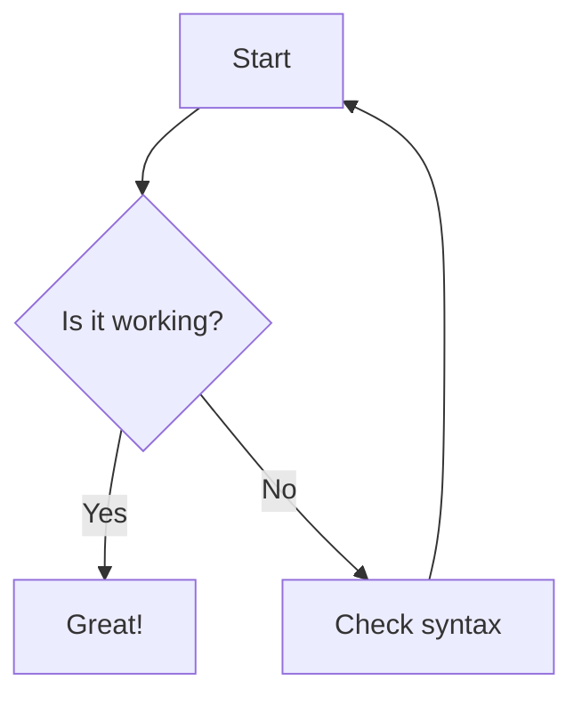
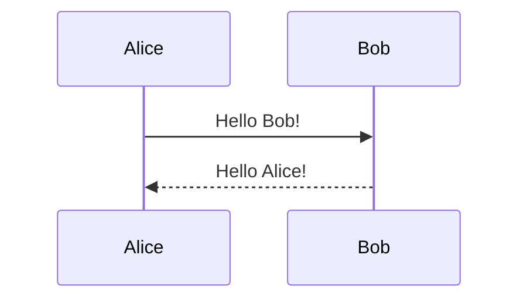

# Test Mermaid Diagram

This is a simple test to make sure Mermaid diagrams render correctly in VS Code.

## Simple Flow Chart

## Simple Sequence Diagram

If these render correctly, then the more complex diagrams should work too! 